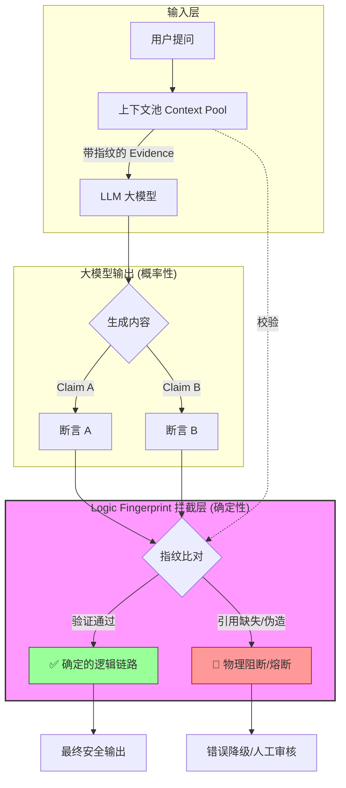

# Logic Fingerprint (logicfp)



`logicfp` is an AI-era call protection layer.

Developer documentation lives in [README.developer.md](D:/workspace/python/logic_fingerprint_ai/README.developer.md).

## Install

```bash
pip install logicfp
```

## Quick Start

```python
from logicfp import protect


@protect()
def call_model(request):
    return {"answer": request.payload["text"].upper()}


result = call_model(payload={"text": "hello"})
```

Use `@protect()` when you want the default entrypoint.  
Use `create_protector()` when you need more than one protector instance.  
Use `logicfp.user_mode` when you want explicit user-mode types like `ErrorCode`, `NormalizationError`, `LogicExecutionError`, and `ProtectRuntimeError`.

## User Mode Contract

The current public contract centers on:

- `protect`
- `create_protector`
- `logicfp.user_mode.ErrorCode`
- `logicfp.user_mode.NormalizationError`
- `logicfp.user_mode.LogicExecutionError`
- `logicfp.user_mode.ProtectRuntimeError`
- `logicfp.config.describe_effective_config`

`logicfp` now recommends user mode as the only public entry model.

## Minimal Config

Put your project config at:

```text
your_project/config/config.yaml
```

```yaml
logicfp:
  instance_id: decorator-node
  default_source: user_function
  backend_type: memory
```

Use `logicfp:` as the main YAML section name. Older `logic_fingerprint:` configs are still accepted for compatibility.  
For user mode, `backend_type: memory` is still the recommended default.

## Failure Styles

`logicfp` supports two user-mode failure styles:

- `simple=True`
  success returns your result directly, failure raises `ProtectRuntimeError`
- `simple=False`
  success returns `ok/result/context`, failure returns `ok/error/context`

Example:

```python
from logicfp import protect


@protect(simple=False)
def review_text(request):
    return {"summary": request.payload["text"][:20]}
```

## Learn More

- User-mode cheatsheet: [documents/Tutorial/user-mode-cheatsheet.md](documents/Tutorial/user-mode-cheatsheet.md)
- Quick user-mode guide: [documents/Tutorial/user-mode-quickstart.md](documents/Tutorial/user-mode-quickstart.md)
- User-mode examples: [documents/Tutorial/user-mode-examples.md](documents/Tutorial/user-mode-examples.md)
- User-mode error codes: [documents/Tutorial/user-mode-error-codes.md](documents/Tutorial/user-mode-error-codes.md)
- User-mode envelope contract: [documents/Tutorial/user-mode-envelope.md](documents/Tutorial/user-mode-envelope.md)
- User mode vs engineering mode: [documents/Tutorial/user-mode-vs-engineering.md](documents/Tutorial/user-mode-vs-engineering.md)
- Config reference: [documents/Tutorial/config-reference.md](documents/Tutorial/config-reference.md)
- Plugin hook guide: [documents/Tutorial/plugin-hooks.md](documents/Tutorial/plugin-hooks.md)


